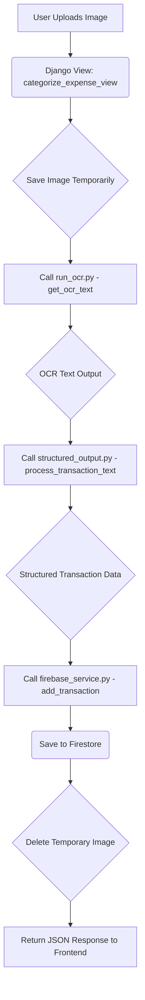

# AI Integration Implementation Plan for Smart Expense Categorization

**Goal:** Allow users to upload an image of a transaction (e.g., a receipt or UPI screenshot), have it processed by OCR and an LLM for categorization, and then save the structured transaction data to Firestore.

## Implementation Plan:

1.  **Prepare `ml_features` Django App:**
    *   **Verify `INSTALLED_APPS`:** Ensure `apps.ml_features` is listed in `INSTALLED_APPS` in `neural_budget/settings.py`.
    *   **Create `urls.py`:** (Already done) Define a URL pattern for the categorization endpoint (e.g., `/ml_features/categorize_expense/`).
    *   **Create `views.py`:** Implement a Django view function (`categorize_expense_view`) to handle the image upload and processing.

2.  **Refactor AI Scripts for Django Integration:**
    *   **`AI/categorization/run_ocr.py`:**
        *   Modify `get_ocr_text` to be a standalone function that takes an image file path as input and returns the extracted text. Remove the `if __name__ == "__main__":` block.
    *   **`AI/categorization/structured_output.py`:**
        *   Encapsulate the LLM prompting, JSON parsing, and `categorize_transaction` logic into a function (e.g., `process_transaction_text`).
        *   This function should accept the OCR text and the `user_id` as arguments.
        *   It should *return* the structured transaction dictionary, rather than directly saving to Firestore. The Firestore saving will be handled by the Django view.
        *   Ensure the HuggingFace API token is loaded securely (e.g., from Django settings or environment variables).

3.  **Implement Django View (`apps/ml_features/views.py`):**
    *   **Handle Image Upload:**
        *   Accept `POST` requests containing an image file.
        *   Securely save the uploaded image to a temporary location (e.g., `media/temp/`).
    *   **Process Image with AI:**
        *   Call the refactored `get_ocr_text` function with the path to the temporary image.
        *   Call the refactored `process_transaction_text` function with the OCR output and the authenticated `user_id` (obtained from the Django session).
    *   **Save to Firestore:**
        *   Use the existing `add_transaction` function from `apps/common_utils/firebase_service.py` to save the structured transaction data to the `transactions` collection in Firestore.
    *   **Cleanup:**
        *   Delete the temporary image file after processing.
    *   **Response:**
        *   Return a `JsonResponse` indicating success or failure, along with the categorized transaction data if successful.
    *   **Security:**
        *   Apply `@csrf_exempt` for now, but note that for production, proper CSRF token handling will be required for file uploads.

4.  **Frontend Integration (High-Level):**
    *   Create a new HTML page or integrate into an existing one (e.g., "Add Transaction" page) with:
        *   An `<input type="file" accept="image/*">` element.
        *   A button to trigger the upload.
    *   Write JavaScript to:
        *   Read the selected image file.
        *   Create a `FormData` object and append the image.
        *   Send an `XMLHttpRequest` or `fetch` request to the `/ml_features/categorize_expense/` endpoint.
        *   Handle the JSON response and display the categorized transaction to the user.

5.  **Error Handling and Logging:**
    *   Add `try-except` blocks in the Django view to catch errors during file handling, OCR, LLM processing, and Firestore operations.
    *   Log errors appropriately for debugging.

6.  **Testing:**
    *   Manually test the full workflow by uploading various types of transaction images.
    *   Verify that transactions are correctly categorized and saved to Firestore.

## Dataflow Diagram:

